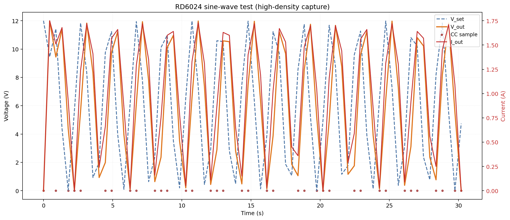
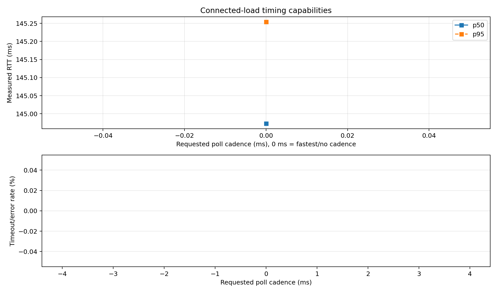
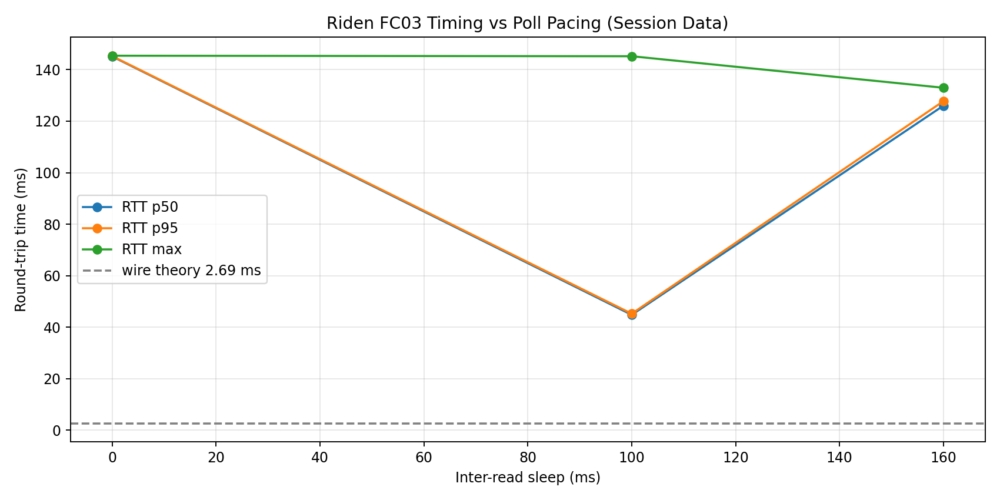
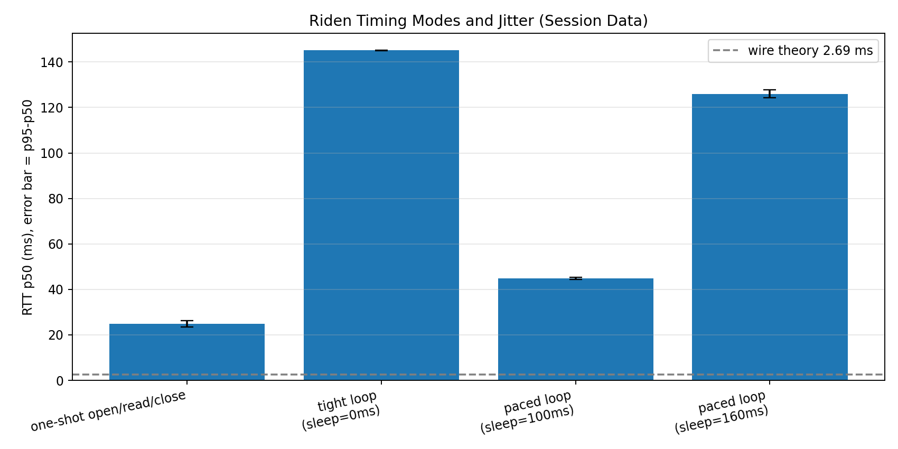

# awto-mcp-riden

MCP server and CLI for RuiDeng/Riden RD60xx and RK6006 power supplies.

This repository provides a direct serial control stack for AI agents and humans:

- MCP tools (`rd_*`) for Copilot/Claude workflows
- CLI (`awto_riden.py`) for bench scripting
- Timing profiler to recommend stable poll cadence
- Characterisation helpers (VI sweep, inrush capture, waveform output)

No external `riden` pip package is required. Transport and register logic are vendored here.

## Capabilities at a glance

Latest high-density sine waveform capture (RD6024, 0.5 Hz):



Connected-load timing capabilities remain available here:



Latest measured set summary:
[docs/timing_test_set_summary.md](docs/timing_test_set_summary.md)

Regenerate all timing artifacts in one command:

```bash
python3 scripts/awto_riden_timing.py --port /dev/ttyUSB0 --voltage 1.0 --current 0.2 --mode both
```

## Quick start

```bash
git clone https://github.com/awto-au/awto-mcp-riden
cd awto-mcp-riden
python3 -m venv .venv && source .venv/bin/activate
pip install -e .

python3 awto_riden.py --port /dev/ttyUSB0 status
python3 awto_riden.py --port /dev/ttyUSB0 profile-serial --count 20 --sleep-ms 100
```

## Timing graphs (updated)

The graphs below were regenerated from session measurements and summarized in
[docs/serial_timing_profile.json](docs/data/serial_timing_profile.json).

For the dedicated MR11 waveform/timing page, see:
[docs/mr11_sine_test.md](docs/mr11_sine_test.md)

For a full register map page (known registers + unknown gaps/ranges), see:
[docs/registers.md](docs/registers.md)

### 1) Poll pacing vs measured RTT



### 2) Mode comparison with jitter bars



Interpretation:

- Wire-time theory at 115200 baud for FC03(9 regs) is about 2.69 ms.
- Measured behavior is much higher and mode-dependent.
- Tight polling and paced polling can land in different scheduler phases.
- For control/logging, stable cadence is usually more important than minimum RTT.

## Why every read takes ~143 ms (the firmware scan floor)

You may notice that measured RTT is ~143 ms regardless of which registers you read,
how many you request, or how long the wire transfer takes.  This is not a code bug
and is not caused by the USB adapter.

**Root cause: the RD6006 firmware measurement scan runs at ~7 Hz (~143 ms/cycle).**

The PSU's embedded firmware samples its ADCs and refreshes its Modbus holding
registers once per firmware cycle, not on demand.  When the host issues a Modbus
read, the device does not reply immediately — it waits until the current firmware
cycle completes and the registers are refreshed, then sends the response.  This
produces a near-constant ~143 ms floor on every transaction regardless of register
count or baud rate.

**Consequence for set → read sequences:**

After a `write_register` (e.g. changing V_SET), the write acknowledgement also takes
~143 ms because it is queued behind the same firmware cycle.  The output hardware
reacts to the new setpoint almost immediately after the write is accepted, but
`v_out` and `i_out` readings will not reflect the new settled state until the *next*
firmware cycle — meaning you need to wait at least **one additional 143 ms cycle**
(~300 ms total) after a setpoint change before reading back a stable measurement.
Waiting two cycles (~300 ms) is a safe rule of thumb for settled readings.

This is an intrinsic hardware limit of the RD6006 firmware and cannot be improved
by tuning baud rate, USB latency timer, or pymodbus settings.

## Timing accuracy and timestamp semantics

This section documents what the timing data means and what it does not mean.

### What is timestamped

- Current measurements are host-side timings around the request/response call.
- In code, this is effectively `perf_counter()` before `write()` and after `read()`.
- So the value includes host scheduling, serial driver behavior, USB/BT transport,
  device turnaround, and response parsing delay.

### What Modbus provides (and does not provide)

- Standard Modbus RTU frames do not include source timestamps.
- The PSU response contains register data only, not capture-time metadata.
- Therefore there is no protocol-native way to recover exact device sampling instant.

### Practical error sources

- Host OS scheduler jitter
- USB serial bridge buffering/latency timer behavior
- Python runtime scheduling and GC pauses
- Device-side internal update cadence (phase effects)
- Link-specific effects (USB vs RFCOMM Bluetooth)

### How to read uncertainty from these measurements

Use distribution statistics, not one sample:

- `p50` approximates typical observed round-trip time
- `p95 - p50` is a useful jitter margin for cadence planning
- `max` highlights outlier stalls and should not be used as the steady-state target

For poll interval selection, prefer:

$$
  ext{poll\_ms} \approx \text{p95} + \text{headroom}
$$

Then quantize to practical scheduler buckets (20 ms or 50 ms).

## Serial profiling framework (USB and BT)

The same profiler output schema is available through CLI and MCP, so USB and
Bluetooth RFCOMM links can be compared directly.

CLI:

```bash
python3 awto_riden.py --port /dev/ttyUSB0 profile-serial --count 20 --sleep-ms 100
```

MCP:

- `rd_profile_serial(count=20, sleep_ms=100)`
- `rd_capabilities()` includes `serial_profile` and `mcp_properties.recommended_poll_ms`

Profiler output fields include:

- `recommended_poll_ms`
- `raw_recommended_poll_ms`
- `quantization_ms`
- `timing.p50_ms`, `timing.p95_ms`, `timing.max_ms`, `timing.jitter_p95_minus_p50_ms`

## Connected-load timing matrix

For characterization-grade testing with a real load, use either the full test-set
runner (quick + comprehensive + analysis) or the direct matrix runner.

Recommended one-command test set (includes fastest/no-cadence point `0 ms`):

```bash
source .venv/bin/activate
python3 scripts/awto_riden_timing.py \
  --port /dev/ttyUSB0 \
  --voltage 1.0 --current 0.2 \
  --mode both \
  --quick-samples 12 \
  --comprehensive-samples 80 \
  --quick-poll-ms 0,100,150 \
  --comprehensive-poll-ms 0,20,50,100,150
```

> **Load required.** The script turns the PSU output ON. Connect a resistive load
> rated for your chosen voltage/current before running. A 3-second abort window is
> printed at startup.

Direct matrix runner:

```bash
source .venv/bin/activate
python3 scripts/awto_riden_timing_matrix.py \
  --port /dev/ttyUSB0 \
  --voltage 1.0 --current 0.2 \
  --poll-ms 0,20,50,100,150 \
  --samples 120 \
  --settle-s 3 \
  --out docs/data/connected_load_timing_matrix
```

Outputs:

- `docs/data/connected_load_timing_matrix_quick.json`
- `docs/data/connected_load_timing_matrix_quick.rtt.png`
- `docs/data/connected_load_timing_matrix_quick.timeout.png`
- `docs/data/connected_load_timing_matrix_comprehensive.json`
- `docs/data/connected_load_timing_matrix_comprehensive.rtt.png`
- `docs/data/connected_load_timing_matrix_comprehensive.timeout.png`
- `docs/timing_test_set_summary.md`
- `docs/data/timing_capabilities_overview.png`

Why this is preferred over tiny sample sets:

- connected loads add thermal and state-dependent variability
- p95 and timeout rate are unstable at very low N
- cadence decisions should be based on repeated distributions, not single traces

Recommended minimums:

- 80 to 120 samples per cadence point
- 6+ cadence points
- optional repeat runs at different times if you need stronger confidence bounds

## MCP interface summary

The server (`mcp/mcp_server.py`) is wired into VS Code via `.vscode/mcp.json` and
auto-discovers connected PSUs at startup (registered disconnected until you
approve them with `rd_connect`). Verified end-to-end against a live RK6006 (all
33 `rd_*` tools register; a hardware-free registration test lives in
`test_harness.py::TestMcp`).

Main categories:

- status/identity: `rd_status`, `rd_firmware`, `rd_capabilities`, `rd_profile_serial`
- control: `rd_set_voltage`, `rd_set_current`, `rd_output`, `rd_set_ovp`, `rd_set_ocp`, `rd_power_cycle`
- logging/characterisation: `rd_log_current`, `rd_log_status`, `rd_log_stop`, `rd_vsweep`, `rd_inrush_capture`, `rd_plot_results`
- raw access: `rd_modbus_read_holding`, `rd_modbus_write_register`
- multi-PSU: `rd_list_psus`, `rd_connect`, `rd_disconnect`, `rd_all_off`

## CLI interface summary

```bash
python3 awto_riden.py --port /dev/ttyUSB0 [--baud 115200] [--address 1] <command>
```

Common commands:

- `status`
- `capabilities`
- `profile-serial`
- `set-voltage`
- `set-current`
- `output`
- `set-ovp`
- `set-ocp`
- `speed-test`
- `info`
- `firmware` — device identity (model/id/serial/fw)
- `flash [firmware.bin]` — reboot to bootloader / flash firmware (requires `--yes`)
- `discover` — find PSUs across serial ports/addresses
- `register-scan` / `diff-scan` — read register space (read-only)

## Bench tooling & generated docs

Two consolidated entry points sit alongside the device CLI (`awto_riden.py`):

- **`scripts/awto-riden-test.py`** — master **hardware** test + characterization runner.
  Chains stages (`identify,status,write,measure,characterize`) with a guaranteed
  safe-state teardown (0 V / 0 A / output OFF) between every stage and on any error.
  ```bash
  scripts/awto-riden-test.py --all --power-limit 60
  scripts/awto-riden-test.py --chain measure,characterize --steps 12
  ```
- **`scripts/awto-riden-dev.py`** — **bench/analysis + docs** tool (no PSU output).
  ```bash
  scripts/awto-riden-dev.py gen-docs                 # regenerate generated docs (see below)
  scripts/awto-riden-dev.py analyze-scan scan.json   # classify a register scan vs the map
  ```

**Generated docs.** The register map and the documentation figures are generated, not
hand-edited. The single source of truth for the register map is **`register_map.py`**
(built on the canonical `riden_register.py`). Regenerate everything with:

```bash
scripts/awto-riden-dev.py gen-docs            # docs/registers.md (+ waveform figures)
```

`docs/registers.md` carries a "GENERATED — do not edit by hand" header; edit
`register_map.py` and re-run `gen-docs` instead.

**See [docs/REGENERATING.md](docs/REGENERATING.md)** for the full runbook: what's
generated vs source, the **capture → `.jsonl` fixture → regenerate** loop (figures
rebuild offline from committed data — no load needed), and the fixture list. The
figures *do* need an appropriate reactive load to **capture** (globe inrush, MR11,
motor); once the `.jsonl` is committed, regeneration needs no hardware.

## Repository structure

```text
awto_riden.py          device CLI (the primary entry point)
register_map.py        single source of truth for the Modbus register map
protocol.py            shared constants / JSON-lines helpers
riden_daemon.py        RidenWorker + RidenDevice + discover_devices
riden_transport.py     SerialTransport (Modbus RTU) + vendored discover() loader
riden_register.py      canonical register constants (verbatim upstream)
riden_flash.py         bootloader firmware loader (MIT reimplementation)
test_harness.py        unittest suite (no hardware required)
mcp/                   MCP stdio server (mcp_server.py) + .vscode wiring
scripts/               bench tooling:
                         awto-riden-test.py   hardware test/characterization runner
                         awto-riden-dev.py    analysis + docs (gen-docs, analyze-scan)
                         awto_riden_*.py      capture/plot/report/ble libraries
docs/                  generated + hand-written docs (see docs/REGENERATING.md)
parked/                not-on-active-path code kept for the future (see parked/README.md)
vendor/                git submodule: awto-serial (shared discover() primitive)
```

## Architecture

```text
Agent/CLI
  -> mcp_server.py / awto_riden.py
  -> riden_daemon.py (RidenWorker)
  -> riden_transport.py (pymodbus + raw serial fallback)
  -> Modbus RTU over USB or RFCOMM
  -> Riden PSU
```

## Safety and ops notes

- Check status before changing setpoints.
- Disable output before large voltage jumps.
- Treat CC at turn-on as expected inrush behavior unless persistent.
- Use `rd_all_off` for emergency multi-PSU shutdown.

## Related projects

| Project | Description |
|---|---|
| [Baldanos/rd6006](https://github.com/Baldanos/rd6006) | Original Python driver and authoritative Modbus register map (Apache-2.0) |
| [ShayBox/Riden](https://github.com/ShayBox/Riden) | Extended Python library covering full RD60xx/RK60xx family (MIT) |
| [rssdev10/riden-flashtool](https://github.com/rssdev10/riden-flashtool) | Rust CLI: firmware flash, calibration wizard, RTC sync, preset import/export (MIT) |
| [tjko/riden-flashtool](https://github.com/tjko/riden-flashtool) | Original Python flash tool that rssdev10's port is derived from (MIT) |
| [simeonmiteff/cal-riden-psu](https://github.com/simeonmiteff/cal-riden-psu) | Calibration scripts for Riden PSUs |
