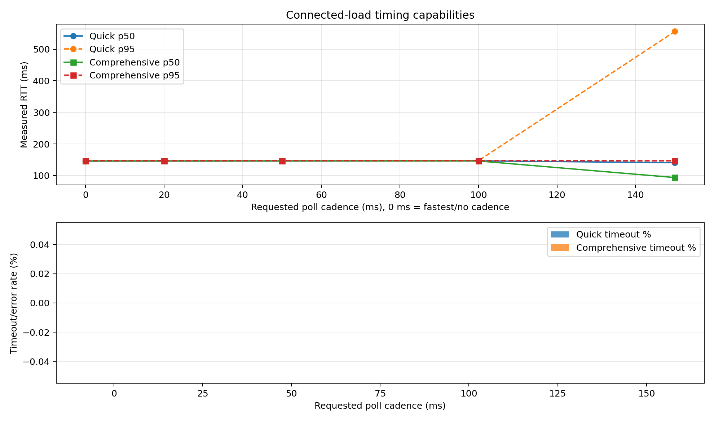

# MR11 Sine Test Report

Connected-load waveform behavior and timing accuracy notes for Riden PSU tests.

## Sine Wave Under Load

These captures show the MR11 lamp response under commanded waveform output. The key behavior is that measured output tracking is limited by poll/update timing, not wire baud alone.


Slow waveform reference capture.


Fast waveform reference capture.

## Connected-Load Timing Test Set

Combined capabilities overview (fastest + cadence suites):



Detailed table output:

- [timing_test_set_summary.md](timing_test_set_summary.md)

### Quick suite (12 samples/point)

- 0 ms (fastest/no cadence): p50 145.779 ms, p95 146.554 ms, jitter 0.775 ms
- 100 ms cadence: p50 146.545 ms, p95 146.878 ms, jitter 0.333 ms
- 150 ms cadence: p50 140.863 ms, p95 555.864 ms, jitter 415.001 ms

### Comprehensive suite (80 samples/point)

- 0 ms (fastest/no cadence): p50 146.320 ms, p95 147.003 ms, jitter 0.682 ms
- 20 ms cadence: p50 146.379 ms, p95 146.949 ms, jitter 0.570 ms
- 50 ms cadence: p50 146.385 ms, p95 147.189 ms, jitter 0.803 ms
- 100 ms cadence: p50 146.257 ms, p95 147.174 ms, jitter 0.918 ms
- 150 ms cadence: p50 93.846 ms, p95 146.632 ms, jitter 52.787 ms

### Recommendation from this run

- Recommended poll cadence: 200 ms (derived from $p95 + 20$ ms headroom, quantized upward)

Artifacts:

- `connected_load_timing_matrix_quick.json`
- `connected_load_timing_matrix_quick.rtt.png`
- `connected_load_timing_matrix_quick.timeout.png`
- `connected_load_timing_matrix_comprehensive.json`
- `connected_load_timing_matrix_comprehensive.rtt.png`
- `connected_load_timing_matrix_comprehensive.timeout.png`
- `timing_test_set_summary.md`
- `timing_capabilities_overview.png`

## Timestamp and Accuracy Notes

- Timings are host-side wall-clock around request/response calls.
- Modbus RTU frames do not carry source timestamps from the PSU.
- No protocol field indicates exact ADC sample instant on device.
- Use distribution metrics (p50/p95/timeout rate), not single values.
- Wire theory (~2.69 ms for FC03 9-reg) is much lower than observed end-to-end timing.

This page should be read as a timing behavior report, not a deterministic per-sample device timestamp trace.

## Regeneration

One command to regenerate quick + comprehensive + analysis artifacts:

```bash
./scripts/regenerate_timing_artifacts.sh /dev/ttyUSB0 12 1.5
```

## Next Step (Exhaustive Matrix)

Run the larger connected-load matrix before final cadence recommendations:

```bash
python3 scripts/connected_load_timing_matrix.py \
  --port /dev/ttyUSB0 \
  --voltage 12 --current 1.5 \
  --poll-ms 0,20,50,100,150,200 \
  --samples 120 \
  --settle-s 3 \
  --out docs/connected_load_timing_matrix_exhaustive
```
