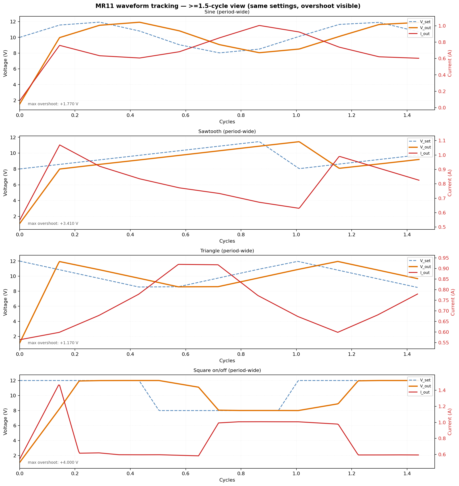

# MR11 Sine Test Report

Connected-load waveform behavior and timing accuracy notes for Riden PSU tests.

## Sine Wave Under Load

These captures show the MR11 lamp response under commanded waveform output. The key behavior is that measured output tracking is limited by poll/update timing, not wire baud alone.



At-least-1.5-cycle comparison for sine, sawtooth, triangle, and square drive using identical center/amplitude settings. Each panel overlays `V_set`, `V_out`, and `I_out`, marks raw sample points, and annotates maximum voltage overshoot. Cycle boundaries (`phase = 0`) are shown with vertical reference lines.


Current-limited sine capture showing clip behavior under low current limit. For this run (`I_limit=0.2 A`):

- rows: 28
- CC samples: 28/28
- protect events (`protect != none`): 0

Interpretation:

- The output is clipping through sustained CC limiting (expected under this limit).
- No OCP/OVP latch event was observed in this run.


Dedicated current-limit demos:

- Top panel: fixed current limit `200 mA`, voltage command follows sine across `0..12 V`.
- Bottom panel: fixed voltage command `12 V`, fixed current limit `300 mA`.
- Red trace segments indicate points where current limiting (CC) is active.
- Light red background spans indicate potential missed-sample intervals (`delta_t > 2.2x median`).

## MR11 Fastest vs Safe vs Comprehensive (rerun)

### 1) Fastest possible with errors/timeout tracking

Run mode: `--read-mode fast`, poll cadence `0 ms`, `240` samples.

- p50: 144.827 ms
- p95: 145.725 ms
- p99: 146.005 ms
- jitter (p95-p50): 0.898 ms
- timeout/error rate: 0.00%

Artifacts:

- `mr11_fastest_errors.json`
- `mr11_fastest_errors.rtt.png`
- `mr11_fastest_errors.timeout.png`

### 2) Safe cadence run

Safe cadence selected from fastest-run tail behavior: `180 ms`.
Run mode: `--read-mode fast`, `240` samples.

- p50: 89.795 ms
- p95: 148.011 ms
- p99: 150.797 ms
- jitter (p95-p50): 58.217 ms
- timeout/error rate: 0.00%

Artifacts:

- `mr11_safe_cadence.json`
- `mr11_safe_cadence.rtt.png`
- `mr11_safe_cadence.timeout.png`

### 3) Comprehensive report

Run mode: `--read-mode fast`, cadences `0,20,50,100,150,180,200`, `120` samples per point.

- 0 ms: p50 144.819, p95 145.731, p99 145.971, timeout 0.00%
- 20 ms: p50 144.835, p95 145.583, p99 145.891, timeout 0.00%
- 50 ms: p50 144.719, p95 145.506, p99 145.549, timeout 0.00%
- 100 ms: p50 144.918, p95 145.628, p99 145.706, timeout 0.00%
- 150 ms: p50 95.586, p95 147.583, p99 150.563, timeout 0.00%
- 180 ms: p50 89.372, p95 149.580, p99 150.609, timeout 0.00%
- 200 ms: p50 90.106, p95 148.182, p99 150.660, timeout 0.00%

Artifacts:

- `mr11_comprehensive_fast_vs_safe.json`
- `mr11_comprehensive_fast_vs_safe.rtt.png`
- `mr11_comprehensive_fast_vs_safe.timeout.png`

Interpretation note:

- Tail behavior (p99) is much more stable for safety sizing than p50 alone.
- Mid/high cadences can show bimodal phase effects (very low p50 with much higher p95/p99).

## Timestamp and Accuracy Notes

- Timings are host-side wall-clock around request/response calls.
- Modbus RTU frames do not carry source timestamps from the PSU.
- No protocol field indicates exact ADC sample instant on device.
- Use distribution metrics (p50/p95/timeout rate), not single values.
- Wire theory (~2.69 ms for FC03 9-reg) is much lower than observed end-to-end timing.

This page should be read as a timing behavior report, not a deterministic per-sample device timestamp trace.

## Regeneration

Waveform captures and plots:

```bash
python3 scripts/awto_riden_waveform_capture.py \
  --port /dev/ttyUSB0 \
  --out-dir docs \
  --freq-hz 0.5 \
  --periods 4 \
  --v-center 10 \
  --v-amp 2 \
  --i-limit-normal 1.5 \
  --i-limit-clipped 0.2

python3 scripts/awto_riden_plot_waveforms.py
```

Fastest run:

```bash
python3 scripts/awto_riden_timing_matrix.py \
  --port /dev/ttyUSB0 \
  --voltage 12 --current 1.5 \
  --poll-ms 0 \
  --samples 240 \
  --settle-s 2 \
  --read-mode fast \
  --out docs/mr11_fastest_errors
```

Safe cadence run:

```bash
python3 scripts/awto_riden_timing_matrix.py \
  --port /dev/ttyUSB0 \
  --voltage 12 --current 1.5 \
  --poll-ms 180 \
  --samples 240 \
  --settle-s 2 \
  --read-mode fast \
  --out docs/mr11_safe_cadence
```

Comprehensive run:

```bash
python3 scripts/awto_riden_timing_matrix.py \
  --port /dev/ttyUSB0 \
  --voltage 12 --current 1.5 \
  --poll-ms 0,20,50,100,150,180,200 \
  --samples 120 \
  --settle-s 2 \
  --read-mode fast \
  --out docs/mr11_comprehensive_fast_vs_safe
```

## Next Step (Exhaustive Matrix)

Run the larger connected-load matrix before final cadence recommendations:

```bash
python3 scripts/awto_riden_timing_matrix.py \
  --port /dev/ttyUSB0 \
  --voltage 12 --current 1.5 \
  --poll-ms 0,20,50,100,150,200 \
  --samples 120 \
  --settle-s 3 \
  --out docs/connected_load_timing_matrix_exhaustive
```
